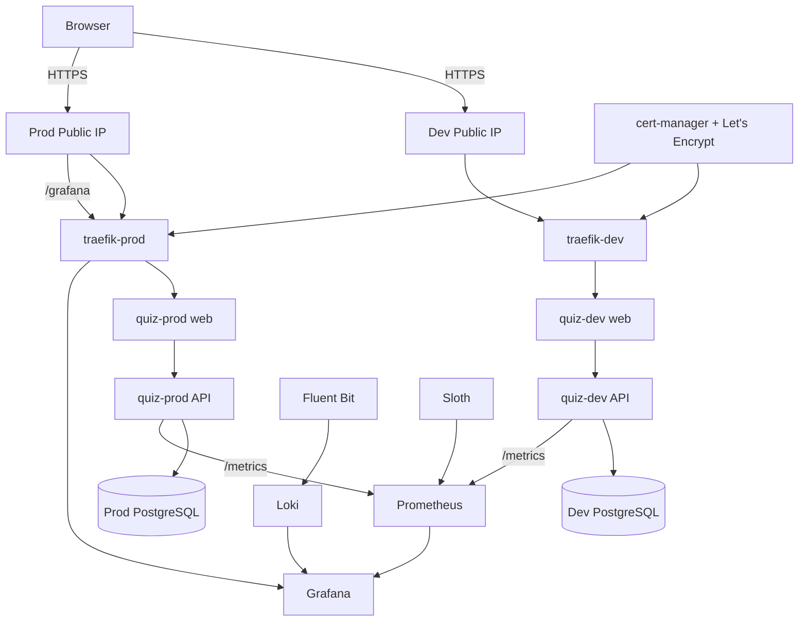

# quiz_app

Production-style MCQ quiz application on Azure using Terraform, AKS, Helm, GitHub Actions, Azure Key Vault, PostgreSQL on AKS, ACR, Traefik, cert-manager, Let's Encrypt, Prometheus, Grafana, Loki, Fluent Bit, Sloth, Log Analytics, and Application Insights.

## Documentation

- [Wiki home](wiki/Home.md)
- [Architecture](wiki/Architecture.md)
- [Destroy and rebuild guide](wiki/Rebuild-Guide.md)
- [Observability guide](observability/README.md)
- [Terraform state management](docs/state-management.md)

## Current architecture

The project uses one shared AKS cluster with separate dev/prod application namespaces plus a shared observability namespace.



The cluster is shared for cost efficiency, while dev and prod have separate namespaces, workload identities, PostgreSQL StatefulSets/PVCs, Public IP/DNS names, Traefik releases, TLS certificates, Helm releases, GitHub Environments, and Terraform state files.

## Application access model

The application currently has **no end-user authentication layer**.

Both dev and prod expose over HTTPS:

- quiz UI and quiz API
- health endpoint
- Admin UI
- `/api/admin/*` CRUD endpoints

The Admin API is intentionally public in the current lab/demo design.

Microsoft Entra/OIDC is still used for infrastructure identities:

- GitHub Actions -> Azure
- Terraform/backend access
- AKS deployment identities
- AKS Workload Identity -> Key Vault

Those infrastructure identities are separate from application-user authentication.

## Terraform state

The Azure Blob backend uses three independent state blobs:

- `shared.tfstate` — network, AKS, ACR, Key Vault, Log Analytics, Application Insights, and shared integration
- `dev.tfstate` — dev identities/RBAC and dev Public IP/DNS
- `prod.tfstate` — prod identities/RBAC and prod Public IP/DNS

There is no separate observability Terraform state or monitoring Public IP.

## Repository layout

```text
.
├── .github/workflows/
│   ├── infrastructure.yml
│   ├── app.yml
│   └── observability.yml
├── app/
│   ├── api/
│   └── web/
├── helm/quiz-app/
├── infra/
│   ├── modules/
│   ├── shared/
│   └── environments/{dev,prod}/
├── observability/
│   ├── kube-prometheus-stack-values.yaml
│   ├── service-monitors.yaml
│   ├── sloth-slos.yaml
│   ├── loki.yaml
│   ├── fluent-bit.yaml
│   └── grafana/
├── wiki/
├── docs/
├── scripts/
└── Makefile
```

## Deployment order

For a fresh deployment:

```text
bootstrap Azure state/OIDC
        ↓
Infrastructure: dev apply
        ↓
Infrastructure: prod apply
        ↓
refresh dev/prod GitHub Environment variables
        ↓
Application: dev
        ↓
Application: prod
        ↓
Observability: run once
        ↓
validate Grafana dev + prod
```

The Observability workflow uses the existing `prod` GitHub Environment for Azure deployment credentials/approval, but the monitoring stack itself is shared and monitors both environments.

## CI/CD

### Infrastructure

`.github/workflows/infrastructure.yml` validates/scans Terraform and manually plans/applies/destroys the selected environment. Shared infrastructure is initialized/checked as part of the workflow.

Authentication to Azure uses GitHub OIDC, not a client secret.

### Application

`.github/workflows/app.yml` performs tests, builds/scans images, pushes SHA-tagged images to ACR, deploys through AKS Run Command, and verifies HTTPS.

Deployment mapping:

```text
pull request          -> tests
push develop          -> deploy dev
push main             -> tests only
workflow_dispatch     -> deploy selected dev or prod
```

### Observability

`.github/workflows/observability.yml` deploys one shared stack:

- Prometheus + Prometheus Operator
- Grafana
- Alertmanager
- kube-state-metrics
- node-exporter
- Sloth
- Loki
- Fluent Bit
- Quiz application dashboard

Prometheus scrapes the dev and prod Quiz APIs at `/metrics`.

## Grafana

Grafana is the only public observability UI and reuses the existing production endpoint:

```text
https://<prod-hostname>/grafana
```

Username:

```text
admin
```

Retrieve the generated password:

```bash
az aks command invoke \
  -g sg-quiz-rg \
  -n sg-quiz-aks \
  --command "kubectl -n observability get secret grafana-admin -o jsonpath='{.data.admin-password}' | base64 -d; echo"
```

Open **Dashboards -> Browse -> Quiz App - Application, Golden Signals, SLOs & Logs**.

Direct dashboard URL:

```text
https://<prod-hostname>/grafana/d/quiz-observability
```

Use the dashboard **Environment** selector to switch between dev and prod.

Prometheus, Loki, Alertmanager, and Sloth remain internal.

## Observability targets

The shared stack provides:

- latency: p50/p95/p99
- traffic: requests/sec and traffic by route
- errors: 5xx ratio and SLO burn rate
- saturation: application CPU/memory versus resource limits
- pod restarts
- quiz submission metrics
- application and infrastructure logs
- Sloth SLO/error-budget information

Current SLOs per environment:

- availability: 99.9%
- latency: 95% of non-health requests within 500 ms
- operational availability guardrail: 99.5%

Prometheus and Loki retain seven days of data with 10 Gi Azure Disk storage each.

## AKS API access

The AKS API server is deliberately restricted. Direct `kubectl` from a workstation or Cloud Shell may time out if its public IP is not authorized.

Operational commands and GitHub deployments therefore use:

```text
az aks command invoke
```

This allows cluster operations without making the Kubernetes API broadly reachable.

## Security notes

- GitHub Actions uses OIDC federation; no Azure client secret is required.
- Pods access Key Vault through AKS Workload Identity.
- PostgreSQL is internal-only and backed by an Azure Disk PVC.
- ACR image pulls use AKS identity.
- Terraform state is remote, encrypted, locked, and split into shared/dev/prod roots.
- Traefik terminates public HTTPS with Let's Encrypt certificates from cert-manager.
- Grafana requires its own admin username/password.
- Prometheus, Loki, Alertmanager, and Sloth are not publicly exposed.
- Application quiz and Admin endpoints are intentionally anonymous in the current design.

## Cost considerations

This repository prioritizes a lab/demo cost profile but still uses real Azure resources. Main recurring costs include AKS nodes, Log Analytics ingestion, Azure Disk storage, and the dev/prod Public IPs.

Grafana reuses the prod Public IP, specifically to avoid creating a third application/monitoring ingress endpoint and unnecessary Public IP quota/cost.

See the [Rebuild Guide](wiki/Rebuild-Guide.md) for the complete operational sequence.
