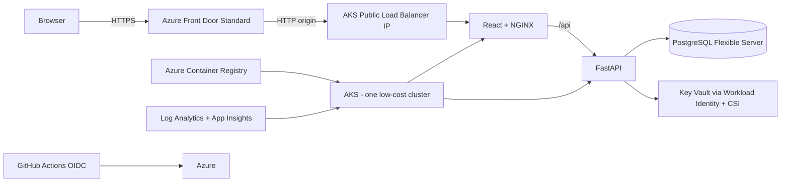

# quiz_app

Production-style MCQ quiz application on Azure using Terraform, AKS, Helm, GitHub Actions, Microsoft Entra ID, Azure Key Vault, Azure Database for PostgreSQL Flexible Server, Azure Container Registry, Azure Monitor, and Azure Front Door.

## Architecture



The cluster is shared to reduce cost, while `dev` and `prod` are isolated with separate namespaces, workload identities, PostgreSQL databases, public IPs, Front Door endpoints, Helm releases, GitHub Environments, and Terraform state files.

## Terraform state and locking

The remote backend is Azure Blob Storage. Azure Blob state locking uses blob leases automatically. The repository deliberately separates state into:

- `shared.tfstate` — VNet, AKS, ACR, Key Vault, PostgreSQL server, monitoring, Front Door profile.
- `dev.tfstate` — dev database, identity/federation, public IP, Front Door endpoint/origin/route.
- `prod.tfstate` — prod database, identity/federation, public IP, Front Door endpoint/origin/route.

GitHub Actions also uses concurrency groups per Terraform root and all Terraform commands use `-lock-timeout=5m` so parallel applies cannot race a locked state.

> The backend itself is created by `scripts/bootstrap-azure.sh` before Terraform can use it. This avoids the circular problem of trying to store Terraform state in a storage account that Terraform has not created yet.

See [`docs/state-management.md`](docs/state-management.md) for the locking, concurrency and destroy-order details.

## Repository layout

```text
.
├── .github/workflows/
│   ├── app.yml
│   └── infrastructure.yml
├── app/
│   ├── api/
│   └── web/
├── helm/quiz-app/
├── infra/
│   ├── modules/{network,aks,database,registry,key-vault,monitoring,frontdoor-profile,environment}/
│   ├── shared/
│   └── environments/{dev,prod}/
├── scripts/
│   ├── bootstrap-azure.sh
│   ├── configure-entra.sh
│   ├── configure-github.sh
│   └── repo-check.py
├── docs/
├── docker-compose.yml
└── Makefile
```

## Prerequisites

Install Azure CLI, Terraform >= 1.8, Docker, kubectl, Helm >= 3.15, Python >= 3.12 and Node.js >= 20. You also need an Azure subscription and permission to create resource groups, role assignments, managed identities and Entra app registrations.

## 1. Bootstrap Azure state + GitHub OIDC

Login and select the subscription, then run:

```bash
az login
az account set --subscription <SUBSCRIPTION_ID>
export AZURE_SUBSCRIPTION_ID=<SUBSCRIPTION_ID>
export AZURE_TENANT_ID=<TENANT_ID>
export GITHUB_OWNER=Fadi-Bedrossian
export GITHUB_REPO=quiz_app
export AZURE_LOCATION=northeurope
./scripts/bootstrap-azure.sh
```

The script creates:

- `sg-tfstate-rg`
- a deterministic globally unique storage account name derived from the subscription ID
- blob container `tfstate`
- `sg-quiz-rg`
- user-assigned identity `sg-gha-terraform`
- OIDC federation for GitHub pull requests, `dev` environment and `prod` environment
- least practical bootstrap roles: Contributor + User Access Administrator on `sg-quiz-rg`, and Storage Blob Data Contributor on the state storage account

It prints the GitHub repository variables to configure.

## 2. GitHub variables and environments

Create GitHub Environments named `dev` and `prod`. Add required reviewers to `prod`.

Repository variables:

```text
AZURE_SUBSCRIPTION_ID
AZURE_TENANT_ID
AZURE_INFRA_CLIENT_ID
TFSTATE_RESOURCE_GROUP=sg-tfstate-rg
TFSTATE_STORAGE_ACCOUNT=<printed by bootstrap script>
TFSTATE_CONTAINER=tfstate
AZURE_RESOURCE_GROUP=sg-quiz-rg
AKS_NAME=sg-quiz-aks
ACR_NAME=<terraform shared output>
ENTRA_CLIENT_ID=<after configure-entra.sh>
ENTRA_AUDIENCE=api://<ENTRA_CLIENT_ID>
ADMIN_GROUP_ID=<optional Entra group object ID>
```

Environment variables added by Terraform output after each environment apply:

```text
AZURE_DEPLOY_CLIENT_ID
PUBLIC_URL
PUBLIC_HOSTNAME
PUBLIC_IP_NAME
KEY_VAULT_NAME
WORKLOAD_IDENTITY_CLIENT_ID
FRONT_DOOR_ID
POSTGRES_HOST
POSTGRES_DATABASE
POSTGRES_ADMIN_USER
```

For a simple setup you can store environment-specific values as GitHub Environment variables under `dev` and `prod`. After Terraform has been applied locally, `scripts/configure-github.sh` can populate those environment variables automatically using the GitHub CLI.

## 3. Terraform locally

The bootstrap script prints the state storage account. Export it:

```bash
export TFSTATE_RESOURCE_GROUP=sg-tfstate-rg
export TFSTATE_STORAGE_ACCOUNT=<name>
export TFSTATE_CONTAINER=tfstate
export ARM_SUBSCRIPTION_ID=<SUBSCRIPTION_ID>
export ARM_TENANT_ID=<TENANT_ID>
```

Initialize and apply shared infrastructure:

```bash
make tf-init-shared
make tf-plan-shared
make tf-apply-shared
```

Then dev and prod:

```bash
make tf-init-dev
make tf-apply-dev
make tf-init-prod
make tf-apply-prod
```

Destroy in reverse order:

```bash
make tf-destroy-prod
make tf-destroy-dev
make tf-destroy-shared
```

## 4. Configure Microsoft Entra ID

After both environment Terraform roots exist, get their URLs:

```bash
DEV_URL=$(terraform -chdir=infra/environments/dev output -raw public_url)
PROD_URL=$(terraform -chdir=infra/environments/prod output -raw public_url)
export DEV_URL PROD_URL AZURE_TENANT_ID
./scripts/configure-entra.sh
```

The script creates an Entra application registration, exposes the `Quiz.Access` delegated API permission and configures SPA redirect URIs for dev/prod. It prints `ENTRA_CLIENT_ID` and `ENTRA_AUDIENCE`.

If `ADMIN_GROUP_ID` is empty, admin operations are denied. Set it to an Entra security group object ID whose members should manage questions.

## 5. Local development

The local stack disables Entra authentication intentionally and uses PostgreSQL in Docker:

```bash
docker compose up --build
```

Open `http://localhost:8080`.

API docs: `http://localhost:8000/docs`.

## 6. CI/CD

### Infrastructure pipeline

`.github/workflows/infrastructure.yml`

- PR: fmt, validate, tfsec/checkov-style Trivy config scan, plans for shared/dev/prod.
- `develop`: applies dev only.
- `main`: applies shared, then prod.
- OIDC only; no Azure client secret.
- Azure Blob remote locking + `-lock-timeout=5m`.
- GitHub Actions concurrency groups prevent same-state races.
- `prod` environment provides manual approval when required reviewers are configured.
- Manual `workflow_dispatch` supports targeted `dev`, `prod`, or `shared` destruction; destroy environment states before shared.

### Application pipeline

`.github/workflows/app.yml`

- lint and tests
- Docker build
- Trivy filesystem/image scan
- push to ACR using commit SHA tags
- AKS authentication via OIDC + kubelogin
- Helm deployment
- rollout verification
- HTTPS smoke test through Azure Front Door

Branch mapping:

```text
develop -> dev
main    -> prod
```

## Kubernetes / Helm

The chart includes:

- frontend and API Deployments
- ClusterIP API Service
- public `LoadBalancer` frontend Service bound to a Terraform-managed Azure Public IP
- separate namespace per environment
- API ServiceAccount using AKS Workload Identity
- ConfigMap for non-secret API runtime configuration
- Secrets Store CSI `SecretProviderClass` backed by Key Vault
- readiness/liveness/startup probes
- requests/limits
- HPA
- PodDisruptionBudget
- rolling updates
- non-root API security context

Useful commands:

```bash
kubectl get pods -n quiz-dev
kubectl get pods -n quiz-prod
helm list -A
kubectl logs -n quiz-dev deploy/quiz-dev-api
```

## Application behavior

The seed contains 20 easy science questions. The API does not return correct answers with the question list; answers are scored server-side and explanations are returned only after submission. The UI supports one-answer MCQs, question/answer randomization, timer, retry, score/results and an Entra-protected admin management screen; the API supports full question CRUD.

## Security notes

- No Azure client secrets are committed.
- GitHub Actions uses OIDC federation.
- Pods access Key Vault via Workload Identity.
- PostgreSQL uses private VNet integration and is not publicly exposed.
- ACR image pulls use the AKS kubelet managed identity.
- Terraform state is remote, locked, encrypted by Azure Storage and separated by shared/dev/prod roots. State can contain sensitive values, so state-container RBAC must remain restricted.
- Production approval is implemented with a GitHub Environment.
- The AKS LoadBalancer allows only `AzureFrontDoor.Backend`/`AzureLoadBalancer` service tags, and NGINX rejects application traffic whose `X-Azure-FDID` does not match this Front Door profile. `/healthz` remains available for load-balancer health probing.

## Cost considerations

This repo prioritizes low cost but is still real Azure infrastructure. Main recurring costs are AKS nodes, PostgreSQL Flexible Server, Front Door Standard, Log Analytics ingestion and public IPs. The defaults use one autoscaling AKS node pool (1–3 nodes), Basic ACR and a burstable PostgreSQL SKU. Review Azure pricing before applying.

## Troubleshooting

**Terraform says state is locked** — another process may own the blob lease. Do not manually break a lock unless you have verified no Terraform process is active. The workflows wait up to 5 minutes.

**OIDC login fails** — verify the GitHub Environment name matches the federated subject (`dev` or `prod`) and `AZURE_INFRA_CLIENT_ID`/`AZURE_DEPLOY_CLIENT_ID` are correct.

**Pods cannot read Key Vault** — verify the ServiceAccount client ID, federated identity subject `system:serviceaccount:<namespace>:quiz-api`, and `Key Vault Secrets User` role.

**Front Door returns 502** — check the frontend LoadBalancer has the Terraform-managed public IP and `/healthz` returns 200 on the origin FQDN.

**Entra login redirects incorrectly** — rerun `configure-entra.sh` after the Terraform public URLs are known and confirm both redirect URIs exist on the SPA app registration.
