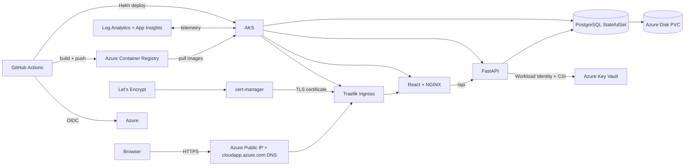
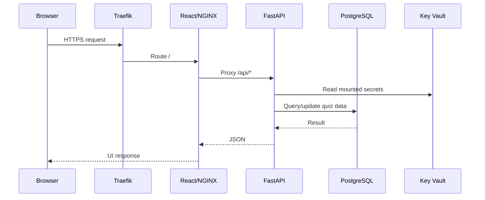
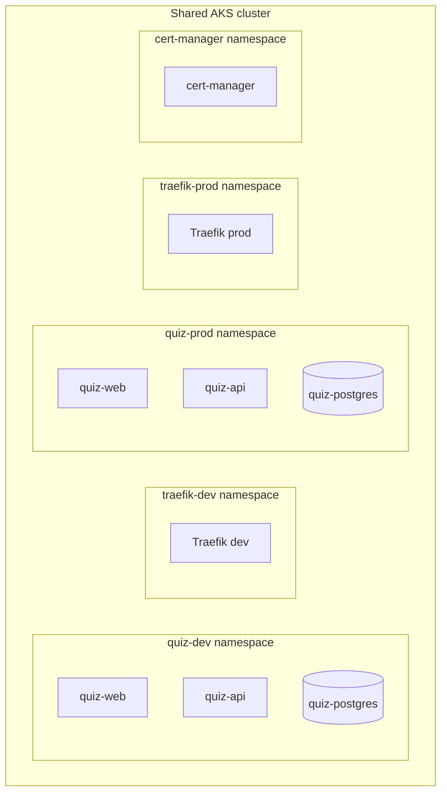
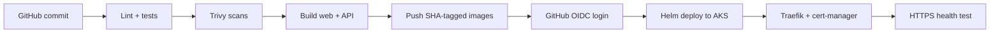
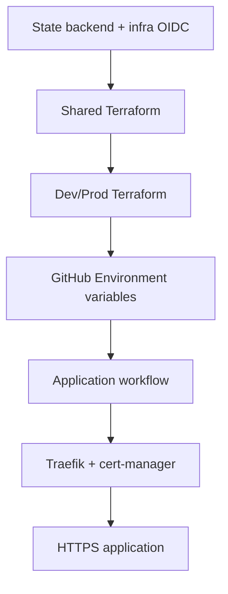

# Architecture

## 1. High-level architecture

The project uses one cost-conscious AKS cluster shared by dev and prod. The two environments are separated by Kubernetes namespaces, Helm releases, PostgreSQL StatefulSets/PVCs, managed identities, public IP/DNS names, Traefik releases, TLS certificates, Terraform state files, and GitHub Environments.



## 2. Browser request path



Traefik terminates TLS. cert-manager obtains a Let's Encrypt certificate with HTTP-01. The frontend service is ClusterIP-only and is exposed through ingress.

## 3. Azure resource ownership

### Bootstrap layer — outside Terraform state

`scripts/bootstrap-azure.sh` creates or reuses the resources Terraform needs before remote state can work:

- `sg-tfstate-rg`
- Terraform state storage account
- `tfstate` blob container
- `sg-quiz-rg`
- `sg-gha-terraform` user-assigned managed identity
- GitHub OIDC federated credentials for pull requests, dev, and prod
- bootstrap RBAC for Terraform and state access

Do not delete the Terraform state storage account before Terraform destroy operations have completed.

### Shared Terraform state — `shared.tfstate`

The shared root owns:

- VNet/subnet
- AKS
- ACR
- Key Vault
- Log Analytics
- Application Insights
- PostgreSQL admin password secret and App Insights connection string
- AKS/ACR/monitoring integration

### Environment states — `dev.tfstate` and `prod.tfstate`

Each environment root owns:

- API workload managed identity
- AKS Workload Identity federation
- Key Vault Secrets User role assignment
- GitHub deployment managed identity
- GitHub OIDC federation for that environment
- AKS/ACR deployment RBAC
- static Azure Public IP
- cloudapp.azure.com DNS label

## 4. Kubernetes layout



Helm releases:

- `quiz-dev` in `quiz-dev`
- `traefik-dev` in `traefik-dev`
- `quiz-prod` in `quiz-prod`
- `traefik-prod` in `traefik-prod`
- shared `cert-manager` in `cert-manager`

PostgreSQL is a single-replica StatefulSet per environment. This is suitable for a lab/demo, not an HA database design.

## 5. CI/CD path



### Infrastructure workflow

`.github/workflows/infrastructure.yml`:

- validates and scans Terraform
- applies shared infrastructure first
- then applies the selected dev or prod environment
- uses Azure OIDC, not client secrets
- uses Azure Blob remote state locking
- does not require a GitHub Environment named `shared`

### Application workflow

`.github/workflows/app.yml`:

- lint/tests
- Docker build
- Trivy scans
- ACR push
- AKS OIDC authentication
- cert-manager installation/update
- environment-specific Traefik
- Helm deployment
- certificate wait
- HTTPS smoke test

For a clean rebuild, deploy **dev first, then prod** after infrastructure and GitHub variables are ready.

## 6. Authentication versus HTTPS

HTTPS and authentication are separate:

- HTTPS protects traffic in transit.
- Microsoft Entra authentication controls access to protected API operations.

Current application behavior:

- the quiz and health endpoints are public in both dev and prod
- only `/api/admin/*` requires Microsoft Entra authentication

The clean two-registration model is:

- `sg-quiz-app` — FastAPI resource API exposing `Quiz.Access`
- `sg-quiz-web` — React SPA requesting delegated `Quiz.Access`

Environment variables for Admin sign-in:

```text
ENTRA_CLIENT_ID=<sg-quiz-web Application client ID>
ENTRA_AUDIENCE=api://<sg-quiz-app Application client ID>
ADMIN_GROUP_ID=<optional security-group object ID>
```

The SPA uses `ENTRA_AUDIENCE` as the scope base and requests `Quiz.Access`. For v2 access tokens, Microsoft Entra emits the API application client ID GUID as the token `aud`; the API validator accepts that GUID derived from the configured `api://...` value.

The API registration should issue v2 access tokens. SPA redirect URIs belong on `sg-quiz-web`. If `ADMIN_GROUP_ID` is empty, any authenticated user in the single tenant with `Quiz.Access` can use admin CRUD; set it to a security-group object ID for stricter authorization.

## 7. Dependency order



Destroy in reverse: application/ingress first, then prod/dev environment resources, then shared Terraform, then bootstrap resource groups/state backend only if a complete reset is intended.
