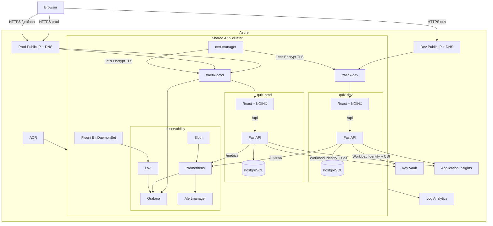
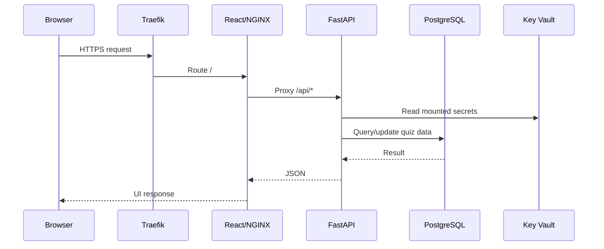
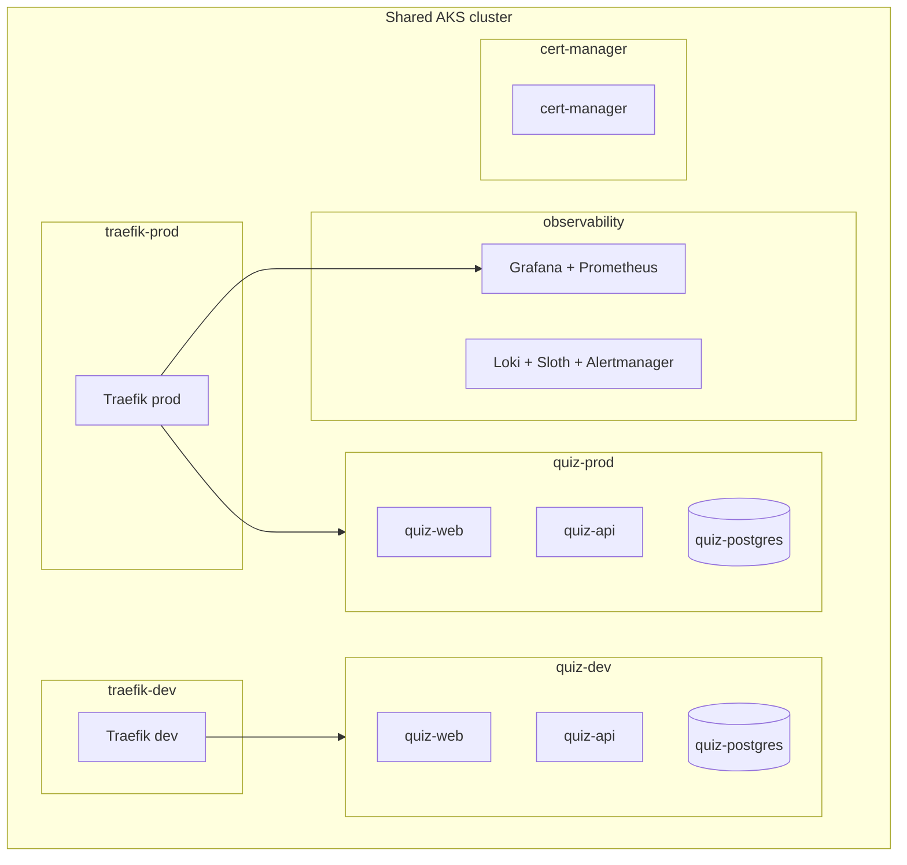
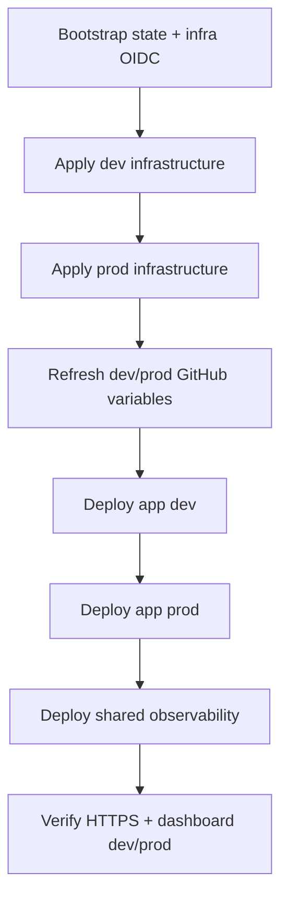

# Architecture

## 1. Current design

The project runs one cost-conscious AKS cluster shared by **dev**, **prod**, and a shared **observability** stack.

Dev and prod are isolated with separate Kubernetes namespaces, Helm releases, PostgreSQL StatefulSets/PVCs, workload identities, deployment identities, public IP/DNS names, Traefik releases, TLS certificates, GitHub Environments, and Terraform state files.

Application access is intentionally simple:

- the quiz UI/API is public over HTTPS in dev and prod
- the Admin UI and `/api/admin/*` CRUD endpoints are also public over HTTPS
- there is **no application-user authentication layer**
- Microsoft Entra/OIDC is still used for **GitHub Actions -> Azure** and AKS/Key Vault workload identity; that infrastructure authentication is unrelated to end-user access

Because Admin CRUD is public, anyone who can reach the application can create, update, or delete quiz questions. That is intentional for the current lab/demo design.

## 2. High-level topology



There is **no separate monitoring Public IP**. Grafana reuses the existing prod public endpoint at:

```text
https://<prod-hostname>/grafana
```

Prometheus, Loki, Alertmanager, Sloth, and the other monitoring services remain internal to the cluster.

## 3. Application request paths

### Quiz and Admin



Traefik terminates TLS and cert-manager obtains Let's Encrypt certificates through HTTP-01.

The frontend and API services are ClusterIP-only. Public application traffic enters through the environment-specific Traefik LoadBalancer.

### Grafana

`traefik-prod` watches both `quiz-prod` and `observability`.

```text
https://<prod-hostname>/          -> quiz-prod web
https://<prod-hostname>/api/*    -> quiz-prod API through NGINX
https://<prod-hostname>/grafana  -> Grafana
```

Grafana is configured with `serve_from_sub_path=true`, so links and static assets work under `/grafana`.

## 4. Observability architecture

One shared observability deployment monitors both application environments.

### Components

- **Prometheus Operator / Prometheus** from `kube-prometheus-stack`
- **Grafana** with Prometheus and Loki datasources
- **Alertmanager**
- **kube-state-metrics**
- **node-exporter**
- **Sloth** for SLI/SLO recording rules and burn-rate alerts
- **Loki** single-binary deployment
- **Fluent Bit** DaemonSet shipping Kubernetes container logs to Loki
- provisioned dashboard: **Quiz App - Application, Golden Signals, SLOs & Logs**

Prometheus ServiceMonitors scrape both:

```text
quiz-dev/quiz-api
quiz-prod/quiz-api
```

at `/metrics` every 15 seconds.

### Application metrics

The API exposes metrics including:

- `quiz_http_requests_total`
- `quiz_http_request_duration_seconds`
- `quiz_http_requests_in_progress`
- `quiz_quiz_submissions_total`
- `quiz_quiz_score_percent`

The Grafana dashboard covers the four golden signals:

- **Latency**: p50, p95, p99
- **Traffic**: requests/sec and traffic by route
- **Errors**: 5xx ratio and SLO burn rate
- **Saturation**: CPU/memory versus Kubernetes resource limits

It also shows pod restarts, quiz submission throughput, application/infrastructure logs, and SLO/error-budget state.

### SLOs

Both `quiz-api-dev` and `quiz-api-prod` use the same targets:

| Type | Objective |
| --- | --- |
| Availability SLO | 99.9% non-health requests avoid 5xx |
| Latency SLO | 95% of non-health requests complete within 500 ms |
| Operational SLA guardrail | 99.5% availability |

Sloth generates Prometheus recording/alerting rules for both environments.

### Retention

- Prometheus: 7 days, 10 Gi Azure Disk
- Loki: 7 days, 10 Gi Azure Disk

This is intentionally sized for a lab/demo cluster.

## 5. Grafana access

Grafana is the only public observability UI.

Open:

```text
https://<prod-hostname>/grafana
```

Login:

```text
username: admin
password: stored in Kubernetes secret observability/grafana-admin
```

Retrieve the password without exposing the AKS API publicly:

```bash
az aks command invoke \
  -g sg-quiz-rg \
  -n sg-quiz-aks \
  --command "kubectl -n observability get secret grafana-admin -o jsonpath='{.data.admin-password}' | base64 -d; echo"
```

After login, go to **Dashboards -> Browse** and open:

**Quiz App - Application, Golden Signals, SLOs & Logs**

Direct dashboard path:

```text
https://<prod-hostname>/grafana/d/quiz-observability
```

The dashboard has an **Environment** selector for `dev` and `prod`.

A Grafana home page showing `Recent dashboards: 0` only means no dashboard has been opened recently; it does not prove that metrics are missing.

## 6. Azure resource ownership

### Bootstrap layer — outside Terraform state

`scripts/bootstrap-azure.sh` creates or reuses:

- `sg-tfstate-rg`
- Terraform state storage account
- `tfstate` blob container
- `sg-quiz-rg`
- `sg-gha-terraform` user-assigned managed identity
- GitHub OIDC federated credentials
- bootstrap RBAC for Terraform and state access

Do not delete the Terraform state backend before Terraform destroy operations complete.

### Shared Terraform state — `shared.tfstate`

The shared root owns:

- VNet/subnet
- AKS
- ACR
- Key Vault
- Log Analytics
- Application Insights
- shared secrets/integration required by the application
- AKS/ACR/monitoring integration

The Kubernetes Prometheus/Grafana/Loki/Sloth stack itself is deployed by the **Observability** workflow rather than Terraform.

### Environment states — `dev.tfstate` and `prod.tfstate`

Each environment root owns:

- API workload managed identity
- AKS Workload Identity federation
- Key Vault role assignment
- GitHub deployment managed identity
- GitHub OIDC federation for the environment
- AKS/ACR deployment RBAC
- static Azure Public IP
- `cloudapp.azure.com` DNS label

There is no third monitoring Public IP/state.

## 7. Kubernetes layout



Primary Helm releases:

- `quiz-dev` in `quiz-dev`
- `traefik-dev` in `traefik-dev`
- `quiz-prod` in `quiz-prod`
- `traefik-prod` in `traefik-prod`
- `monitoring` in `observability`
- `sloth` in `observability`
- shared `cert-manager` in `cert-manager`

PostgreSQL is a single-replica StatefulSet per environment and is not HA.

## 8. CI/CD workflows

### Infrastructure — `.github/workflows/infrastructure.yml`

- validates/scans Terraform
- applies shared infrastructure before the selected environment
- uses GitHub OIDC to Azure; no Azure client secret
- uses Azure Blob remote state locking
- deploys only the `dev` or `prod` Terraform roots

### Application — `.github/workflows/app.yml`

- lint/tests
- Docker build
- Trivy scans
- ACR push with commit SHA tags
- deploy through AKS Run Command
- Helm deployment
- environment-specific Traefik
- cert-manager/TLS verification
- HTTPS smoke test

Deployment mapping:

```text
pull request          -> tests
push develop          -> deploy dev
push main             -> tests only
manual workflow run   -> deploy selected dev or prod
```

### Observability — `.github/workflows/observability.yml`

- validates observability YAML/dashboard JSON
- deploys one cluster-wide stack
- uses the existing **prod GitHub Environment only for Azure deployment credentials/approval**
- monitors both dev and prod
- updates `traefik-prod` to watch the `observability` namespace
- exposes only Grafana at `/grafana`
- leaves Prometheus/Loki/Alertmanager internal

There is no separate `observability` GitHub Environment.

## 9. AKS API access model

The AKS API server is intentionally restricted. Direct `kubectl` from Cloud Shell or a workstation may time out unless that client IP is authorized.

The repository workflows avoid opening the control plane by using:

```text
az aks command invoke
```

for cluster operations.

The GitHub deployment identities have the necessary AKS Azure RBAC roles. Interactive users also need an appropriate AKS Azure RBAC role if they invoke Kubernetes commands through Run Command.

## 10. Dependency and rebuild order



For a clean rebuild:

1. bootstrap state/OIDC
2. apply dev infrastructure
3. apply prod infrastructure
4. refresh GitHub Environment variables
5. deploy application to dev
6. validate dev
7. deploy application to prod
8. validate prod
9. run Observability once
10. validate Grafana, Prometheus targets, Loki logs, and Sloth SLOs

Destroy in reverse. Remove the Traefik LoadBalancer releases before destroying their Terraform-managed Public IPs. The observability namespace can be removed before shared AKS destruction, but it owns no separate public IP.
