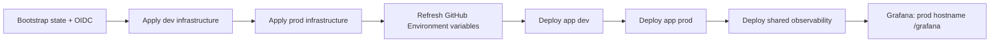

# Quiz App Wiki

This folder is the operational wiki for `quiz_app`.

## Pages

- [Architecture](Architecture.md) — current Azure/AKS topology, dev/prod separation, public application access, shared observability, Grafana access, CI/CD, and security boundaries.
- [Destroy and Rebuild Guide](Rebuild-Guide.md) — safe destroy/rebuild order, Terraform/GitHub configuration, application deployment, observability deployment, and validation.

The dedicated observability implementation guide also lives at [`observability/README.md`](../observability/README.md).

## Current deployment model



There are only two GitHub deployment environments: **dev** and **prod**.

The application has **no end-user authentication layer**. Quiz and Admin UI/API access are public over HTTPS in both environments. GitHub OIDC and AKS Workload Identity are infrastructure identities and do not represent application-user login.

## Observability at a glance

One observability stack inside the shared AKS cluster monitors both `quiz-dev` and `quiz-prod`:

```text
Prometheus -> metrics from dev + prod
Loki       -> logs from dev + prod + infrastructure
Sloth      -> SLOs for dev + prod
Grafana    -> dashboards for both environments
```

Grafana is the only public observability UI:

```text
https://<prod-hostname>/grafana
```

Prometheus, Loki, Alertmanager, and Sloth remain internal.

After logging in to Grafana, open **Dashboards -> Browse -> Quiz App - Application, Golden Signals, SLOs & Logs**. The dashboard has an **Environment** selector for `dev` and `prod`.

## Golden rule

Infrastructure comes first, application deployment comes second, and the shared Observability workflow comes after both application environments expose `/metrics`.

Do not create a separate monitoring Public IP. Grafana deliberately reuses the existing prod Traefik/Public IP at the `/grafana` path.
