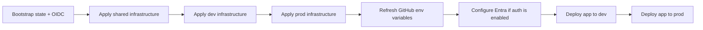

# Quiz App Wiki

This folder is the operational wiki for `quiz_app`.

## Pages

- [Architecture](Architecture.md) — end-to-end request path, Azure resources, CI/CD flow, environment separation, security boundaries, and dependency order.
- [Destroy and Rebuild Guide](Rebuild-Guide.md) — safe destroy order and the exact sequence to bootstrap Azure again, reapply Terraform, refresh GitHub variables, configure Entra when required, and redeploy dev then prod.

## Golden rule

Infrastructure comes first. Deploy the application only after the selected environment infrastructure exists and its GitHub Environment variables have been refreshed.

There are only two GitHub deployment environments in this repository: **dev** and **prod**.
