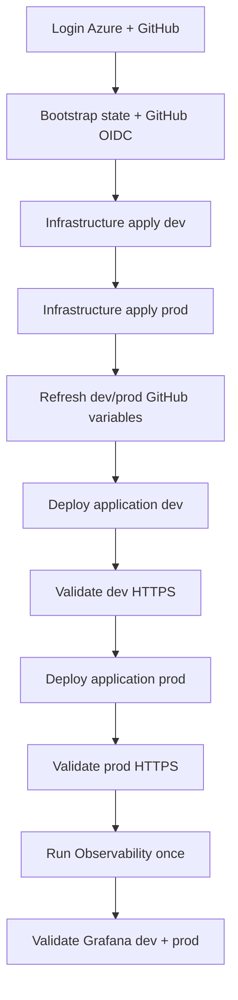

# Destroy and Rebuild Guide

This runbook describes the current repository and deployed architecture.

> Keep the Terraform state backend until all Terraform destroy operations have finished.

## 1. Current rebuild order



There is no Entra application-registration step. The quiz and Admin UI/API are public over HTTPS in both dev and prod.

The Observability workflow is shared. It uses the **prod GitHub Environment for Azure deployment credentials/approval**, but it monitors both `quiz-dev` and `quiz-prod`.

## 2. Prerequisites and login

```bash
git clone https://github.com/Fadi-Bedrossian/quiz_app.git
cd quiz_app
git checkout main
git pull --ff-only

az login --tenant "<TENANT_ID>" --use-device-code
az account set --subscription "<SUBSCRIPTION_ID>"
gh auth login
gh auth status
```

Set common values:

```bash
export AZURE_SUBSCRIPTION_ID="<SUBSCRIPTION_ID>"
export AZURE_TENANT_ID="<TENANT_ID>"
export AZURE_LOCATION="northeurope"
export AZURE_RESOURCE_GROUP="sg-quiz-rg"
export TFSTATE_RESOURCE_GROUP="sg-tfstate-rg"
export TFSTATE_CONTAINER="tfstate"
export GITHUB_OWNER="Fadi-Bedrossian"
export GITHUB_REPO="quiz_app"
export REPO="$GITHUB_OWNER/$GITHUB_REPO"
```

## 3. Destroy safely

Find the state storage account and bootstrap identity:

```bash
export TFSTATE_STORAGE_ACCOUNT="$(
  az storage account list     -g "$TFSTATE_RESOURCE_GROUP"     --query '[0].name'     -o tsv
)"

export ARM_SUBSCRIPTION_ID="$AZURE_SUBSCRIPTION_ID"
export ARM_TENANT_ID="$AZURE_TENANT_ID"
export ARM_CLIENT_ID="$(
  az identity show     -g "$AZURE_RESOURCE_GROUP"     -n sg-gha-terraform     --query clientId     -o tsv
)"

make tf-init-shared
make tf-init-dev
make tf-init-prod
```

### Remove Kubernetes ingress before Terraform Public IP destruction

Dev and prod each have one Terraform-managed Public IP attached to their Traefik LoadBalancer.

Grafana does **not** have a separate Public IP. It reuses `traefik-prod` at `/grafana`.

Because the AKS API server is restricted, `az aks command invoke` is the safest default for cluster cleanup:

```bash
az aks command invoke   -g "$AZURE_RESOURCE_GROUP"   -n sg-quiz-aks   --command "
    helm uninstall monitoring -n observability || true;
    helm uninstall sloth -n observability || true;
    kubectl delete namespace observability --ignore-not-found;

    helm uninstall quiz-prod -n quiz-prod || true;
    helm uninstall traefik-prod -n traefik-prod || true;
    kubectl delete namespace quiz-prod traefik-prod --ignore-not-found;

    helm uninstall quiz-dev -n quiz-dev || true;
    helm uninstall traefik-dev -n traefik-dev || true;
    kubectl delete namespace quiz-dev traefik-dev --ignore-not-found
  "
```

cert-manager can remain if the shared AKS cluster is about to be destroyed.

### Destroy Terraform in reverse order

```bash
make tf-destroy-prod
make tf-destroy-dev
make tf-destroy-shared
```

Only after all Terraform roots are destroyed should a complete reset remove the bootstrap resource groups:

```bash
az group delete -n sg-quiz-rg --yes
az group delete -n sg-tfstate-rg --yes
```

The Terraform-state resource group is deliberately last.

## 4. Bootstrap from zero

```bash
export AZURE_SUBSCRIPTION_ID="<SUBSCRIPTION_ID>"
export AZURE_TENANT_ID="<TENANT_ID>"
export GITHUB_OWNER="Fadi-Bedrossian"
export GITHUB_REPO="quiz_app"
export AZURE_LOCATION="northeurope"

./scripts/bootstrap-azure.sh
```

The script recreates the state backend, project resource group, Terraform managed identity, RBAC, and GitHub OIDC configuration.

If the deterministic storage-account name is unavailable:

```bash
export TFSTATE_STORAGE_ACCOUNT="<globally-unique-lowercase-name>"
./scripts/bootstrap-azure.sh
```

## 5. GitHub Environments

Only these deployment environments are required:

```bash
gh api --method PUT "repos/$REPO/environments/dev" >/dev/null
gh api --method PUT "repos/$REPO/environments/prod" >/dev/null
```

Do not create a `shared` or `observability` GitHub Environment.

The Observability workflow intentionally uses the existing `prod` environment for Azure OIDC credentials and any production approval gate.

## 6. Repository variables

Configure/verify repository-level variables:

```bash
export TFSTATE_STORAGE_ACCOUNT="$(
  az storage account list     -g sg-tfstate-rg     --query '[0].name'     -o tsv
)"

export AZURE_INFRA_CLIENT_ID="$(
  az identity show     -g sg-quiz-rg     -n sg-gha-terraform     --query clientId     -o tsv
)"

gh variable set AZURE_SUBSCRIPTION_ID --repo "$REPO" --body "$AZURE_SUBSCRIPTION_ID"
gh variable set AZURE_TENANT_ID --repo "$REPO" --body "$AZURE_TENANT_ID"
gh variable set AZURE_INFRA_CLIENT_ID --repo "$REPO" --body "$AZURE_INFRA_CLIENT_ID"
gh variable set TFSTATE_RESOURCE_GROUP --repo "$REPO" --body "sg-tfstate-rg"
gh variable set TFSTATE_STORAGE_ACCOUNT --repo "$REPO" --body "$TFSTATE_STORAGE_ACCOUNT"
gh variable set TFSTATE_CONTAINER --repo "$REPO" --body "tfstate"
gh variable set AZURE_RESOURCE_GROUP --repo "$REPO" --body "sg-quiz-rg"
gh variable set AKS_NAME --repo "$REPO" --body "sg-quiz-aks"
gh variable set AZURE_LOCATION --repo "$REPO" --body "northeurope"
gh variable set GITHUB_OWNER_ID --repo "$REPO" --body "59285089"
gh variable set GITHUB_REPO_ID --repo "$REPO" --body "1408354219"
```

## 7. Reapply infrastructure

Apply dev first:

```bash
gh workflow run infrastructure.yml   --repo "$REPO"   --ref main   -f environment=dev   -f operation=apply   -f confirm_destroy=false
```

After success, apply prod:

```bash
gh workflow run infrastructure.yml   --repo "$REPO"   --ref main   -f environment=prod   -f operation=apply   -f confirm_destroy=false
```

The workflow ensures the shared Terraform root is ready before the selected environment root.

Each environment owns its own application Public IP/DNS hostname. Do not attempt to create another Public IP for observability; Grafana reuses the prod endpoint.

## 8. Refresh dev/prod GitHub Environment variables

After Terraform has created the environment resources:

```bash
export ARM_SUBSCRIPTION_ID="$AZURE_SUBSCRIPTION_ID"
export ARM_TENANT_ID="$AZURE_TENANT_ID"
export ARM_CLIENT_ID="$AZURE_INFRA_CLIENT_ID"

make tf-init-shared
make tf-init-dev
make tf-init-prod

./scripts/configure-github.sh
```

Verify:

```bash
gh variable list --env dev --repo "$REPO"
gh variable list --env prod --repo "$REPO"
```

Expected generated environment values include:

```text
AZURE_DEPLOY_CLIENT_ID
PUBLIC_URL
PUBLIC_HOSTNAME
PUBLIC_IP_NAME
KEY_VAULT_NAME
WORKLOAD_IDENTITY_CLIENT_ID
POSTGRES_HOST
POSTGRES_DATABASE
POSTGRES_ADMIN_USER
ACR_NAME
```

No application-user authentication variables are required for the current public app behavior.

## 9. Deploy the application

### Dev

```bash
gh workflow run app.yml   --repo "$REPO"   --ref main   -f environment=dev
```

Wait for the workflow and HTTPS health check to succeed.

### Prod

```bash
gh workflow run app.yml   --repo "$REPO"   --ref main   -f environment=prod
```

The application workflow deploys through AKS Run Command, so the GitHub runner does not need direct access to the restricted AKS API endpoint.

## 10. Validate application HTTPS

```bash
DEV_URL="$(gh variable get PUBLIC_URL --env dev --repo "$REPO")"
PROD_URL="$(gh variable get PUBLIC_URL --env prod --repo "$REPO")"

echo "Dev:  $DEV_URL"
echo "Prod: $PROD_URL"

curl -fsS "$DEV_URL/api/healthz"
curl -fsS "$PROD_URL/api/healthz"
```

Expected:

```json
{"status":"ok"}
```

The following are intentionally public in both environments:

```text
/
 /api/healthz
 /api/questions
 /api/quiz/submit
 /api/admin/questions
 /api/admin/questions/{id}
```

The Admin API permits CRUD without a bearer token in the current design.

## 11. Deploy shared observability

Run this **once**, after both applications are deployed:

```bash
gh workflow run observability.yml   --repo "$REPO"   --ref main
```

The workflow:

- deploys/updates Prometheus, Grafana, Alertmanager, kube-state-metrics and node-exporter
- deploys Loki and Fluent Bit
- deploys Sloth and SLO resources
- creates ServiceMonitors for `quiz-dev` and `quiz-prod`
- provisions the Quiz dashboard
- updates `traefik-prod` so it watches the `observability` namespace
- exposes only Grafana at `https://<prod-hostname>/grafana`

It does not create a new Public IP.

## 12. Validate observability

Because direct `kubectl` may be blocked by AKS API authorized-IP restrictions, use:

```bash
az aks command invoke   -g sg-quiz-rg   -n sg-quiz-aks   --command "
    echo '=== PODS ===';
    kubectl get pods -n observability;
    echo '=== PVCs ===';
    kubectl get pvc -n observability;
    echo '=== SERVICEMONITORS ===';
    kubectl get servicemonitors -n observability;
    echo '=== SLOS ===';
    kubectl get prometheusservicelevels -n observability;
    echo '=== RULES ===';
    kubectl get prometheusrules -n observability | grep -E 'quiz-api|NAME';
    echo '=== GRAFANA INGRESS ===';
    kubectl get ingress,certificate -n observability
  "
```

Expected SLO resources:

```text
quiz-api-dev
quiz-api-prod
```

Each should show three desired/ready SLOs with generation successful.

## 13. Access Grafana

Get the prod URL:

```bash
PROD_URL="$(gh variable get PUBLIC_URL --env prod --repo "$REPO")"
echo "$PROD_URL/grafana"
```

Open:

```text
https://<prod-hostname>/grafana
```

Username:

```text
admin
```

Retrieve the generated password:

```bash
az aks command invoke   -g sg-quiz-rg   -n sg-quiz-aks   --command "kubectl -n observability get secret grafana-admin -o jsonpath='{.data.admin-password}' | base64 -d; echo"
```

Then go to:

**Dashboards -> Browse -> Quiz App - Application, Golden Signals, SLOs & Logs**

Direct dashboard URL:

```text
https://<prod-hostname>/grafana/d/quiz-observability
```

Use the **Environment** selector to switch between `dev` and `prod`.

If the Grafana home page shows `Recent dashboards: 0`, that only means the dashboard has not been opened recently.

## 14. Troubleshooting dashboard/metrics

Check that the provisioned dashboard ConfigMap exists and has the expected label:

```bash
az aks command invoke   -g sg-quiz-rg   -n sg-quiz-aks   --command "kubectl get configmap quiz-observability-dashboard -n observability --show-labels"
```

Check data sources in Grafana under **Connections -> Data sources**. You should see:

```text
Prometheus
Loki
```

Check that Prometheus discovered both application ServiceMonitors:

```bash
az aks command invoke   -g sg-quiz-rg   -n sg-quiz-aks   --command "kubectl get servicemonitors -n observability"
```

Useful application metric names:

```text
quiz_http_requests_total
quiz_http_request_duration_seconds
quiz_http_requests_in_progress
quiz_quiz_submissions_total
quiz_quiz_score_percent
```

## 15. Final checklist

- [ ] state backend bootstrapped
- [ ] dev infrastructure applied
- [ ] prod infrastructure applied
- [ ] dev/prod GitHub Environment variables refreshed
- [ ] dev application deployed and HTTPS health check passes
- [ ] prod application deployed and HTTPS health check passes
- [ ] no end-user authentication is expected
- [ ] Observability workflow run once
- [ ] Prometheus sees `quiz-api-dev` and `quiz-api-prod`
- [ ] Sloth shows 3/3 SLOs for dev and prod
- [ ] Grafana opens at `<prod-url>/grafana`
- [ ] Quiz dashboard loads and switches between dev/prod
- [ ] Loki logs are visible in the dashboard or Explore
