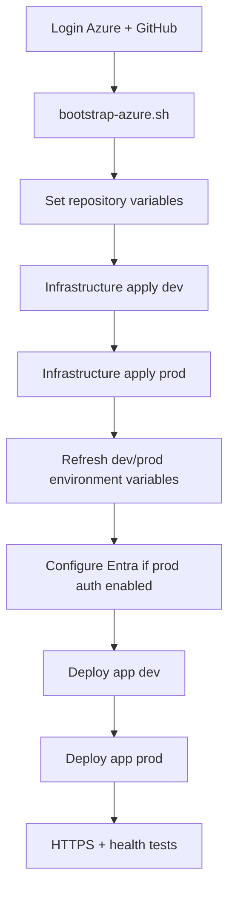

# Destroy and Rebuild Guide

This runbook is for intentionally destroying the Azure deployment and rebuilding it from the repository.

> **Important:** keep the Terraform state backend until Terraform destroy operations finish.

## 1. Rebuild order



**Infrastructure first, then app dev, then app prod.**

## 2. Prerequisites and login

```bash
git clone https://github.com/Fadi-Bedrossian/quiz_app.git
cd quiz_app
git checkout main
git pull --ff-only

az login --tenant "<TENANT_ID>" --use-device-code
az account set --subscription "<SUBSCRIPTION_ID>"
gh auth login
gh auth status
```

Set common values:

```bash
export AZURE_SUBSCRIPTION_ID="<SUBSCRIPTION_ID>"
export AZURE_TENANT_ID="<TENANT_ID>"
export AZURE_LOCATION="northeurope"
export AZURE_RESOURCE_GROUP="sg-quiz-rg"
export TFSTATE_RESOURCE_GROUP="sg-tfstate-rg"
export TFSTATE_CONTAINER="tfstate"
export GITHUB_OWNER="Fadi-Bedrossian"
export GITHUB_REPO="quiz_app"
export REPO="$GITHUB_OWNER/$GITHUB_REPO"
```

## 3. Destroy safely

Find the existing state storage account and bootstrap identity:

```bash
export TFSTATE_STORAGE_ACCOUNT="$(
  az storage account list -g "$TFSTATE_RESOURCE_GROUP" --query '[0].name' -o tsv
)"
export ARM_SUBSCRIPTION_ID="$AZURE_SUBSCRIPTION_ID"
export ARM_TENANT_ID="$AZURE_TENANT_ID"
export ARM_CLIENT_ID="$(
  az identity show -g "$AZURE_RESOURCE_GROUP" -n sg-gha-terraform --query clientId -o tsv
)"

make tf-init-shared
make tf-init-dev
make tf-init-prod
```

### Remove application ingress first

The public IPs are attached to Traefik LoadBalancer services, including the dedicated Grafana monitoring endpoint, so uninstall those releases before destroying Terraform-managed public IPs.

```bash
az aks get-credentials -g "$AZURE_RESOURCE_GROUP" -n sg-quiz-aks --overwrite-existing

helm uninstall quiz-prod -n quiz-prod || true
helm uninstall traefik-prod -n traefik-prod || true
helm uninstall traefik-observability -n traefik-observability || true
kubectl delete namespace quiz-prod traefik-prod traefik-observability --ignore-not-found

helm uninstall quiz-dev -n quiz-dev || true
helm uninstall traefik-dev -n traefik-dev || true
kubectl delete namespace quiz-dev traefik-dev --ignore-not-found
```

cert-manager can remain because the AKS cluster will be destroyed with shared infrastructure.

### Destroy Terraform in reverse order

```bash
make tf-destroy-prod
make tf-destroy-dev
make tf-destroy-shared
```

Only after all three succeed, a full reset can remove the bootstrap resource groups:

```bash
az group delete -n sg-quiz-rg --yes
az group delete -n sg-tfstate-rg --yes
```

The state resource group is deliberately last.

Microsoft Entra app registrations are directory objects and are not removed by these Terraform/resource-group deletes.

## 4. Bootstrap from zero

```bash
export AZURE_SUBSCRIPTION_ID="<SUBSCRIPTION_ID>"
export AZURE_TENANT_ID="<TENANT_ID>"
export GITHUB_OWNER="Fadi-Bedrossian"
export GITHUB_REPO="quiz_app"
export AZURE_LOCATION="northeurope"

./scripts/bootstrap-azure.sh
```

The script recreates the state backend, project RG, infrastructure managed identity, RBAC, and GitHub OIDC.

If the deterministic storage account name is unavailable after deletion:

```bash
export TFSTATE_STORAGE_ACCOUNT="<globally-unique-lowercase-name>"
./scripts/bootstrap-azure.sh
```

## 5. Ensure only dev and prod GitHub Environments exist for deployment

```bash
gh api --method PUT "repos/$REPO/environments/dev" >/dev/null
gh api --method PUT "repos/$REPO/environments/prod" >/dev/null
```

Do not create a `shared` GitHub Environment.

## 6. Refresh GitHub repository variables

```bash
export TFSTATE_STORAGE_ACCOUNT="$(
  az storage account list -g sg-tfstate-rg --query '[0].name' -o tsv
)"
export AZURE_INFRA_CLIENT_ID="$(
  az identity show -g sg-quiz-rg -n sg-gha-terraform --query clientId -o tsv
)"

gh variable set AZURE_SUBSCRIPTION_ID --repo "$REPO" --body "$AZURE_SUBSCRIPTION_ID"
gh variable set AZURE_TENANT_ID --repo "$REPO" --body "$AZURE_TENANT_ID"
gh variable set AZURE_INFRA_CLIENT_ID --repo "$REPO" --body "$AZURE_INFRA_CLIENT_ID"
gh variable set TFSTATE_RESOURCE_GROUP --repo "$REPO" --body "sg-tfstate-rg"
gh variable set TFSTATE_STORAGE_ACCOUNT --repo "$REPO" --body "$TFSTATE_STORAGE_ACCOUNT"
gh variable set TFSTATE_CONTAINER --repo "$REPO" --body "tfstate"
gh variable set AZURE_RESOURCE_GROUP --repo "$REPO" --body "sg-quiz-rg"
gh variable set AKS_NAME --repo "$REPO" --body "sg-quiz-aks"
gh variable set AZURE_LOCATION --repo "$REPO" --body "northeurope"
gh variable set GITHUB_OWNER_ID --repo "$REPO" --body "59285089"
gh variable set GITHUB_REPO_ID --repo "$REPO" --body "1408354219"
```

## 7. Reapply infrastructure

Run a **new** Infrastructure workflow for dev:

```bash
gh workflow run infrastructure.yml --repo "$REPO" --ref main \
  -f environment=dev -f operation=apply -f confirm_destroy=false
```

Wait for success, then run prod:

```bash
gh workflow run infrastructure.yml --repo "$REPO" --ref main \
  -f environment=prod -f operation=apply -f confirm_destroy=false
```

The workflow applies shared infrastructure before the selected environment.

## 8. Populate dev/prod GitHub Environment variables from new Terraform outputs

```bash
export ARM_SUBSCRIPTION_ID="$AZURE_SUBSCRIPTION_ID"
export ARM_TENANT_ID="$AZURE_TENANT_ID"
export ARM_CLIENT_ID="$AZURE_INFRA_CLIENT_ID"

make tf-init-shared
make tf-init-dev
make tf-init-prod

./scripts/configure-github.sh
```

Verify:

```bash
gh variable list --env dev --repo "$REPO"
gh variable list --env prod --repo "$REPO"
```

This refreshes generated values including deploy identity, public URL/hostname/IP name, Key Vault, workload identity, PostgreSQL settings, and ACR name.

## 9. Entra for Admin authentication

The normal quiz is public. Microsoft Entra is used only for the Admin screen and `/api/admin/*`; the app registrations are not Terraform-managed.

Use:

- `sg-quiz-app`: single-tenant API, Application ID URI `api://<API_CLIENT_ID>`, delegated scope `Quiz.Access`, requested access token version 2.
- `sg-quiz-web`: single-tenant SPA, redirect URIs equal to the current dev and prod `PUBLIC_URL` values, delegated `Quiz.Access` permission, admin consent granted.

Set:

```bash
for ENV in dev prod; do
  gh variable set ENTRA_CLIENT_ID --env "$ENV" --repo "$REPO" \
    --body "<sg-quiz-web-client-id>"

  gh variable set ENTRA_AUDIENCE --env "$ENV" --repo "$REPO" \
    --body "api://<sg-quiz-app-client-id>"
done
```

For admin authorization, set `ADMIN_GROUP_ID` to the security-group object ID.

If the Entra registrations survived the rebuild, update SPA redirect URIs if the newly generated public URLs changed.

## 10. Deploy application: dev first, prod second

Dev:

```bash
gh workflow run app.yml --repo "$REPO" --ref main -f environment=dev
```

After dev succeeds and its HTTPS health check passes, prod:

```bash
gh workflow run app.yml --repo "$REPO" --ref main -f environment=prod
```

Always create a **new** workflow run after changing variables; do not use an old run's “Re-run jobs”.

## 11. Validate

```bash
DEV_URL="$(gh variable get PUBLIC_URL --env dev --repo "$REPO")"
PROD_URL="$(gh variable get PUBLIC_URL --env prod --repo "$REPO")"

echo "Dev:  $DEV_URL"
echo "Prod: $PROD_URL"

curl -fsS "$DEV_URL/api/healthz"
curl -fsS "$PROD_URL/api/healthz"
```

Expected:

```json
{"status":"ok"}
```

Kubernetes checks:

```bash
kubectl get pods -n quiz-dev
kubectl get pods -n quiz-prod
kubectl get ingress,issuer,certificate -n quiz-dev
kubectl get ingress,issuer,certificate -n quiz-prod
kubectl get svc -n traefik-dev
kubectl get svc -n traefik-prod
```

## 12. Checklist

- [ ] state backend bootstrapped first
- [ ] repository variables refreshed
- [ ] shared + dev infrastructure applied
- [ ] shared + prod infrastructure applied
- [ ] dev/prod Environment variables refreshed from Terraform
- [ ] Entra settings refreshed if prod auth is enabled
- [ ] app deployed to dev
- [ ] dev HTTPS health test passes
- [ ] app deployed to prod
- [ ] prod HTTPS health test passes
